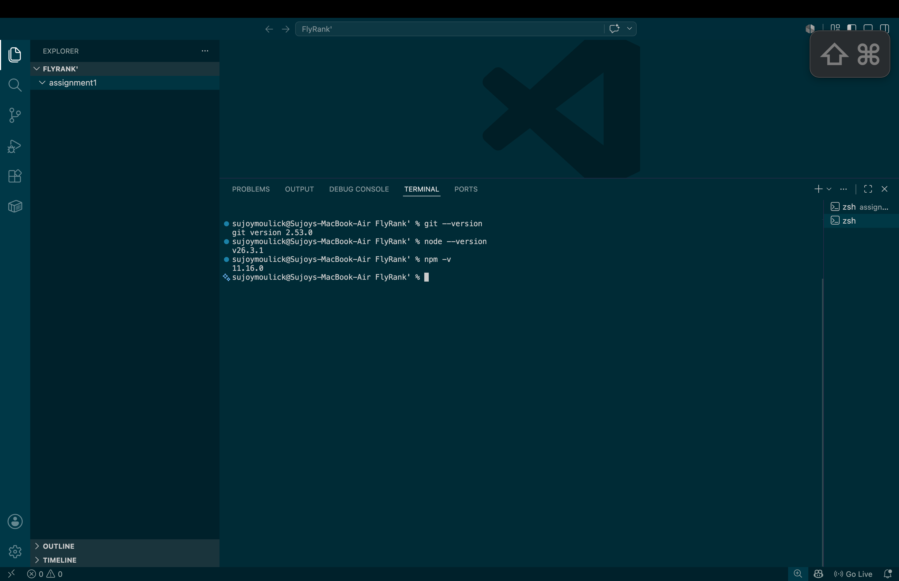
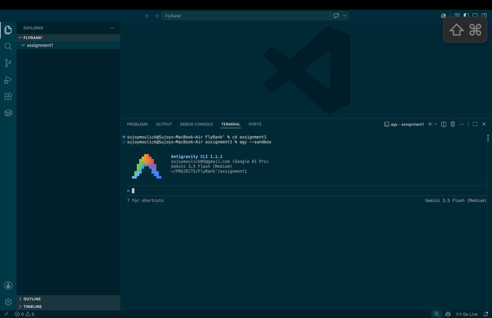

# Assignment 1 - Project Title

A clean, production-grade repository structure for Assignment 1.

## 📋 Overview

This project is a web application/service built for Assignment 1. It implements the core specifications and features required, focused on reliability, performance, and clean code practices.

*Provide a brief summary of what this assignment achieves, its main objectives, and key features.*

---

 ## 🛠️ Tech Stack

### Core Runtime

### IDE & Version Control

### Code Quality & Formatting

### AI Assistants & Developer Tooling

*(Add other specific libraries, database, or frameworks here as the project grows, e.g., Express.js, TypeScript, etc.)*

---

##  Screenshots

Below are the screenshots confirming the successful installation and configuration of the development environment (Node.js LTS, Git, and VS Code):

| Installation Verification | Preview |
|---|---|
| **Tech Stack & Tooling Verification - Part 1** |  |
| **Tech Stack & Tooling Verification - Part 2** |  |

---

## 📄 License

This project is licensed under the MIT License - see the [LICENSE](LICENSE) file for details.
